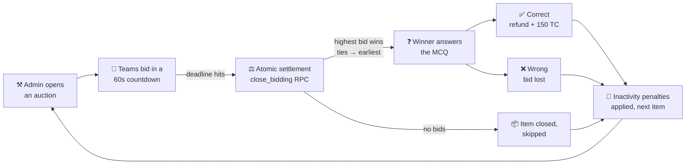
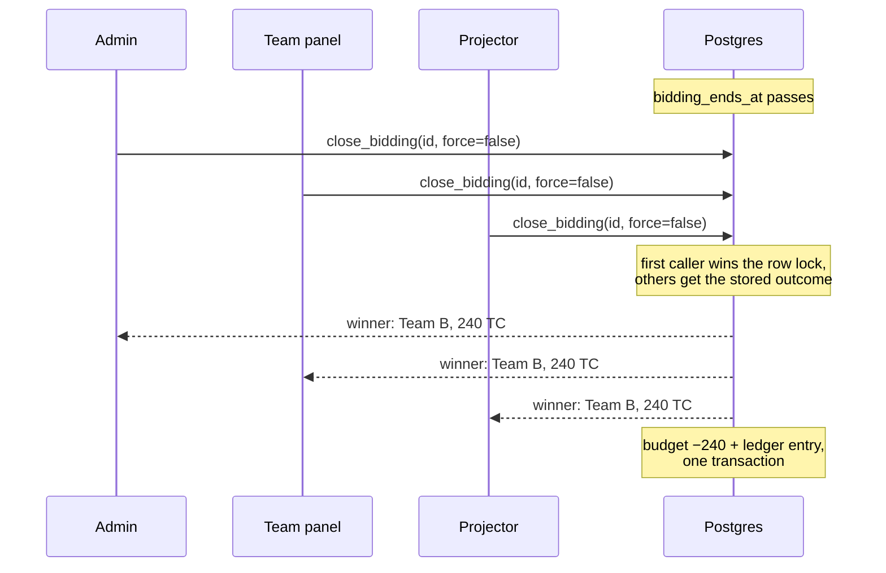

<div align="center">

# ⚡ TECH AUCTION

### *Where knowledge goes under the hammer*

**A real-time auction-quiz arena for national-level technical competitions.**
8 teams · 1,000 Tech Coins · 60-second bidding wars · one winner per question.

[](https://react.dev)
[](https://www.typescriptlang.org)
[](https://vite.dev)
[](https://tailwindcss.com)
[](https://supabase.com)
[](https://vercel.com)

</div>

---

## 🎯 The Format

Round 3 of the quiz — *the auction round*. Every team starts with the same purse of
**Tech Coins (TC)**. The quizmaster puts a technology up for auction, and teams bid
against each other in a **60-second war**. The highest bidder buys the *right* to
answer the question attached to the item:

> Bid high, answer right → your bid is **refunded** plus a **+150 TC** bonus.
> Bid high, answer wrong → your coins are **gone**.
> Sit out too long → the market punishes you.

Survive to the top 4 and you advance. Overbid greedily and you're funding everyone
else's scoreboard.

```
        ┌─────────────┐      ┌─────────────┐      ┌─────────────┐
        │  ⚒  BID     │ ───▶ │  ⚡ ANSWER   │ ───▶ │  🏆 SCORE    │
        │ 60 seconds  │      │ MCQ pick    │      │ live ranks  │
        │ all teams   │      │ winner only │      │ all screens │
        └─────────────┘      └─────────────┘      └─────────────┘
              ▲                                          │
              └──────────── next item, new round ◀───────┘
```

## 🎮 Game Loop



### 💰 The economy

| Rule | Effect |
|---|---|
| **Correct answer** | Bid fully refunded **+ 150 TC bonus** |
| **Wrong answer** | You lose exactly what you bid — no extra penalty |
| **Inactivity** | 3 rounds without winning → automatic **−150 TC** |
| **Difficulty presets** | `basic` 50 TC / `intermediate` 100 TC / `expert` 200 TC starting bids, with matching reward & penalty tiers |
| **Qualification** | Top **4** of 8 teams advance (score → budget → correct answers tie-break) |

## 🖥 Three screens, one truth

| | **🛡 Admin Control Room** | **👥 Team Dashboard** | **📺 Projector Display** |
|---|---|---|---|
| Route | `/admin` (auth) | `/team` (auth) | `/display` (public) |
| Powers | Start/close auctions, question timer, grade answers, bonuses, TC adjustments, item editor with MCQ builder, audit logs, CSV export, demo reset | Quick-bid chips + custom bids, live bid feed, MCQ picker, budget & rank stats | Giant bid counter, bid feed, leaderboard, countdowns for the whole hall |
| Sees | Everything, including the answer key | Item, bids, own attempt | Item, bids, MCQ options — no answers |

Every screen ticks from the **same clock** and settles from the **same transaction**.
That's not a slogan — it's the whole architecture:

## 🧠 Under the hood — three hard problems, three permanent fixes

<details>
<summary><b>⚖️ Problem 1: "Admin says team A won, the question went to B"</b></summary>

Concurrent bids + client-side winner logic meant the admin panel and team screens
could disagree about who won. **Fix:** `close_bidding()` — a `SECURITY DEFINER`
Postgres function that locks the auction row (`FOR UPDATE`), picks the winner
**deterministically** (highest bid, ties broken by earliest bid), deducts the budget,
writes the ledger entry, and bumps stats — all in **one transaction**. Idempotent:
closing twice is a no-op, so admin, every team, and the projector can all fire the
auto-close simultaneously and race safely.


</details>

<details>
<summary><b>⏱ Problem 2: "The admin timer runs faster than the team panels"</b></summary>

Per-device countdowns drift — different clocks, refetch jank, countdowns jumping.
**Fix:** the deadline is a single absolute timestamp (`bidding_ends_at`) stored in the
database, and every client measures its own offset against the **server clock** via a
`get_server_time()` RPC with half-RTT correction. Countdowns become a pure function
of `(deadline − serverNow)`: monotonic, and identical on every device in the hall.
</details>

<details>
<summary><b>💸 Problem 3: "Two teams bid at once and the lower bid won"</b></summary>

Select-then-insert bid flows race; last-write-wins could resurrect an outbid value.
**Fix:** bids upsert atomically on a unique `(auction, team)` index; the auction's
`current_bid` update is **guarded** (`.lt('current_bid', amount)`) so only a genuinely
higher bid can land — a loser's update matches zero rows, the bid is withdrawn
(`is_valid = false`), and the team gets a real "outbid" message instead of a phantom win.
</details>

<details>
<summary><b>🔐 Security posture</b></summary>

- **Row Level Security on every table** — teams read/write only their own rows, admins via role policies
- **Anon read policies scoped to the projector route** (`/display` runs logged-out) — public data only: live auction, bids, items, settings
- **Winner settlement and admin checks enforced inside the database**, not the client (`close_bidding` verifies the caller's admin role server-side)
- **Supabase anon key only** in the frontend — no service-role secrets in the browser
- Honest footnote: the current auction payload embeds the full item row, so the answer key *is* technically reachable by a determined team with devtools — flagged for a sanitized view/RPC before showtime
</details>

## 🚀 Quickstart

### 1 · Clone & install

```bash
git clone https://github.com/inferno4670/Tech-Auction.git
cd Tech-Auction
npm install
```

### 2 · Create the Supabase project

1. Create a project at [supabase.com](https://supabase.com)
2. In **SQL Editor**, run the migrations **in order**:

   ```text
   database/migrations/001_initial_schema.sql        # tables, RLS, indexes, triggers
   database/migrations/002_enable_realtime.sql       # realtime broadcasts
   database/migrations/003_add_rounds_inactive.sql   # inactivity counter
   database/migrations/004_fix_auction_rls_for_bidding.sql
   database/migrations/005_add_timer_paused.sql
   database/migrations/006_ensure_admin_profile.sql
   database/migrations/007_fix_bids_upsert_and_rls.sql
   database/migrations/008_mcq_bidding_timer_and_scoring.sql   # MCQ + 60s timer + atomic settlement
   database/migrations/009_pin_get_server_time_search_path.sql
   database/migrations/010_anon_read_for_display_route.sql     # public projector reads
   ```

   All migrations are idempotent — safe to re-run.
3. Seed the venue: `database/seed.sql` (default event settings + sample tech items)

### 3 · Configure & run

```bash
cp .env.example .env
# .env
# VITE_SUPABASE_URL=https://your-project.supabase.co
# VITE_SUPABASE_ANON_KEY=your_anon_key

npm run dev        # http://localhost:5173
```

### 4 · Create the cast

| Who | How |
|---|---|
| 🛡 **Quizmaster** | Supabase Auth → add user → `INSERT INTO profiles (id, email, role, display_name) VALUES ('<user-id>', '...', 'admin', 'Quizmaster');` |
| 👥 **Teams** | Create teams in the admin UI (auto-generates 8), then link each auth user: `INSERT INTO team_members (user_id, team_id) VALUES ('<user-id>', '<team-id>');` |

### 5 · Run the show

Open three windows — `/admin`, a `/team` login, and the `/display` projector —
and watch the countdowns tick in perfect lock-step.

## 🗺 Project structure

```text
src/
├── pages/
│   ├── admin/        # Dashboard · Teams · Auctions · Live Control · Leaderboard · Logs · Settings
│   ├── team/         # TeamDashboard — bidding + MCQ answering
│   └── display/      # DisplayPage — the hall's projector view
├── components/
│   ├── layout/       # AdminLayout, TeamLayout
│   ├── ui/           # Modals, badges, animated numbers, spinners
│   └── ...
├── hooks/
│   ├── useAuth.tsx   # Auth context
│   └── useRealtime.ts# Supabase Realtime subscriptions (auctions, bids, teams, settings)
├── lib/
│   ├── supabase.ts   # Client
│   ├── serverTime.ts # ⏱ Server-clock sync (half-RTT offset)
│   ├── queries.ts    # All DB operations incl. closeBidding RPC wrapper
│   └── utils.ts
├── types/index.ts    # Domain types + difficulty presets
└── index.css         # Tailwind 4 theme, neon glow, animations

database/
├── migrations/       # 001 → 010, ordered, idempotent
└── seed.sql          # Event settings + sample items
```

## 🛠 Scripts

| Command | What it does |
|---|---|
| `npm run dev` | Vite dev server with HMR |
| `npm run build` | Type-check (`tsc -b`) + production bundle |
| `npm run lint` | oxlint over the codebase |
| `npm run preview` | Serve the production build locally |

## ☁️ Deploy

**Vercel** (SPA fallback rewrite included): import the repo, add
`VITE_SUPABASE_URL` + `VITE_SUPABASE_ANON_KEY`, deploy. Deep links like
`/display` and `/admin/login` resolve correctly out of the box.

> 💡 **Event-day tip:** free-tier Supabase projects auto-pause after inactivity —
> restore the project from the dashboard the morning of the competition, and you're live.

## 📜 License

MIT — run your own auction night. 🔨

<div align="center">
<sub>Built for the floor: React 19 · Supabase Realtime · one atomic transaction per hammer fall.</sub>
</div>
