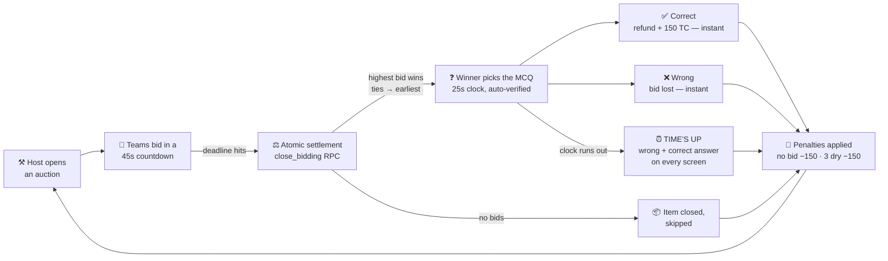
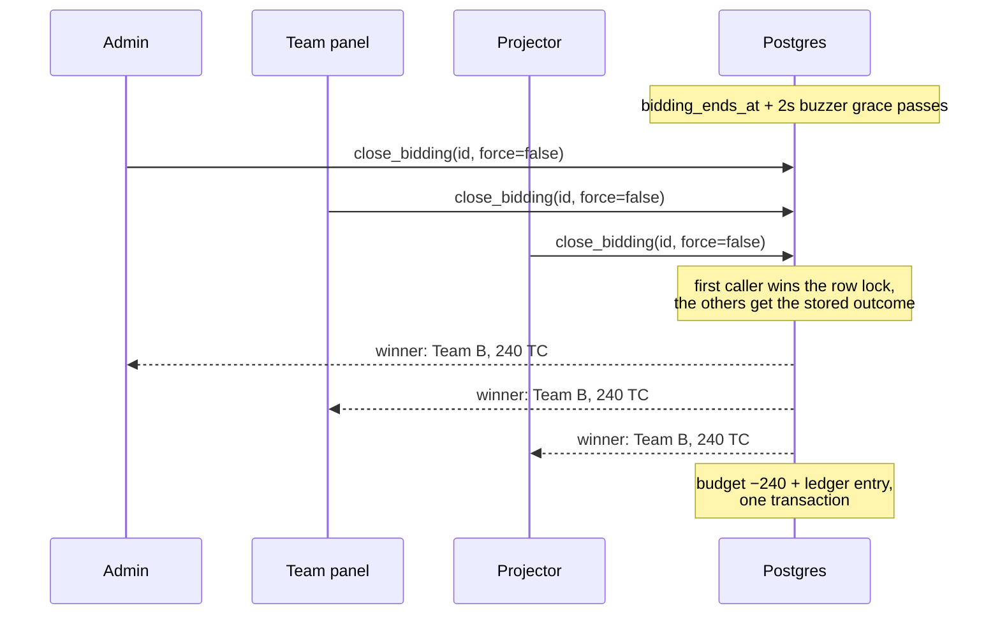
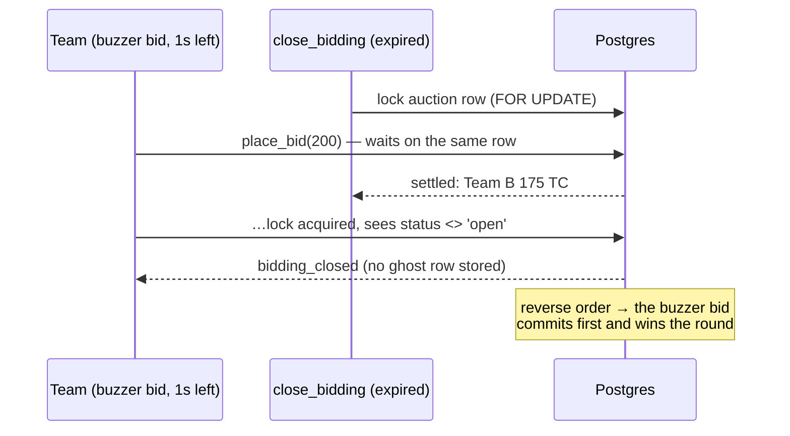

<div align="center">

# ⚡ TECH AUCTION

### *Where knowledge goes under the hammer*

**A real-time auction-quiz arena you can run anywhere** — a quiz night, a classroom,
a club meet, a corporate offsite, or a full finals stage.
Any number of teams · 1,000 Tech Coins · 45-second bidding wars · one winner per question.

[](https://react.dev)
[](https://www.typescriptlang.org)
[](https://vite.dev)
[](https://tailwindcss.com)
[](https://supabase.com)
[](https://vercel.com)

</div>

---

## 🎯 The Format

One auction, one question, every team in the room. Each team starts with the same
purse of **Tech Coins (TC)**. A host puts an item up for auction, teams bid against
each other in a **45-second war**, and the highest bidder buys the *right* to answer
the question attached to it — on a **25-second clock**, auto-verified the moment
they tap an option:

> Bid high, answer right → your bid is **refunded** plus a **+150 TC** bonus.
> Bid high, answer wrong → your coins are **gone**.
> Let the clock run out → marked wrong, **TIME'S UP** across the hall.
> Sit out too long → the market punishes you.

Survive to the top 6 and you advance. Overbid greedily and you're funding everyone
else's scoreboard.

**No prerequisite round, no fixed cast.** The platform *is* the event: two teams in
a classroom or fifteen on a stage. Create the teams, add your questions, open the
projector — auctions, the MCQ bank, the scoring economy, live rankings, an audit
trail and CSV exports are all already in the box.

```
        ┌─────────────┐      ┌─────────────┐      ┌─────────────┐
        │  ⚒  BID     │ ───▶ │  ⚡ ANSWER   │ ───▶ │  🏆 SCORE    │
        │ 60 seconds  │      │ MCQ pick    │      │ live ranks  │
        │ all teams   │      │ winner only │      │ all screens │
        └─────────────┘      └─────────────┘      └─────────────┘
              ▲                                          │
              └──────────── next item, new round ◀───────┘
```

## 🎮 Game Loop



### 💰 The economy

| Rule | Effect |
|---|---|
| **Correct answer** | Bid fully refunded **+ 150 TC bonus** — verified inside the database, instantly |
| **Wrong answer** | You lose exactly what you bid — no extra penalty |
| **Clock runs out** | The round settles itself: wrong, bid lost, **TIME'S UP** + the correct answer on every screen |
| **Sat out the bidding** | Never placed a bid in a round that ran → automatic **−150 TC** |
| **Inactivity** | 3 straight rounds without a win → automatic **−150 TC** |
| **One charge per round** | If a team trips both penalties, only one applies — no bid wins the tie — so a round can never double-charge |
| **Difficulty presets** | `basic` 50 TC / `intermediate` 100 TC / `expert` 200 TC starting bids, with matching reward & penalty tiers |
| **Qualification** | Top **6** advance by default (score → budget → correct answers tie-break) — the cutoff is a single constant |

## 🖥 Three screens, one truth

| | **🛡 Admin Control Room** | **👥 Team Dashboard** | **📺 Projector Display** |
|---|---|---|---|
| Route | `/admin` (auth) | `/team` (auth) | `/display` (public) |
| Powers | Start/close auctions, pause/restart the answer clock, grade answers (override only — MCQs auto-verify), bonuses, TC adjustments, item editor with MCQ builder, audit logs, CSV export, demo reset | Quick-bid chips + custom bids, live bid feed, MCQ picker with **instant verdict**, budget & rank stats, TC-adjustment notices | Giant bid counter, bid feed, gold/silver/bronze leaderboard, countdowns and TIME'S UP announcements for the whole hall |
| Sees | Everything, including the answer key | Item, bids, own attempt | Item, bids, MCQ options — no answers |

Every screen ticks from the **same clock** and settles from the **same transaction**.
That's not a slogan — it's the whole architecture. When a question is graded, all
three screens are told at the same moment: the admin panel and every team dashboard
flash an instant verdict toast, and the projector throws the result full-screen
across the hall (`CORRECT! · TEAM NAME · +500 TC`).

## 🧠 Under the hood — five hard problems, five permanent fixes

<details>
<summary><b>⚖️ Problem 1: "Admin says team A won, the question went to B"</b></summary>

Concurrent bids + client-side winner logic meant the admin panel and team screens
could disagree about who won. **Fix:** `close_bidding()` — a `SECURITY DEFINER`
Postgres function that locks the auction row (`FOR UPDATE`), picks the winner
**deterministically** (highest bid, ties broken by earliest bid), deducts the budget,
writes the ledger entry, and bumps stats — all in **one transaction**. Idempotent:
closing twice is a no-op, so admin, every team, and the projector can all fire the
auto-close simultaneously and race safely.


</details>

<details>
<summary><b>⏱ Problem 2: "The admin timer runs faster than the team panels"</b></summary>

Per-device countdowns drift — different clocks, refetch jank, countdowns jumping.
**Fix:** the deadline is a single absolute timestamp (`bidding_ends_at`) stored in the
database, and every client measures its own offset against the **server clock** via a
`get_server_time()` RPC with half-RTT correction. Countdowns become a pure function
of `(deadline − serverNow)`: monotonic, and identical on every device in the hall.
</details>

<details>
<summary><b>💸 Problem 3: "Two teams bid at once and the lower bid won"</b></summary>

Select-then-insert bid flows race; last-write-wins could resurrect an outbid value.
**Fix:** bids go through the `place_bid()` RPC — one transaction that locks the
auction row, validates status / deadline / budget / minimum increment, upserts the
bid on the unique `(auction, team)` index and moves `current_bid` in the same breath.
The team is identified from the JWT (never the request body), so a client cannot bid
as someone else, and the caller gets a precise reason when a bid is refused.
</details>

<details>
<summary><b>⚡ Problem 4: "A team bid with 2 seconds left and the question went to the second-last bidder"</b></summary>

This was the nastiest one the hall produced. Placing a bid used to take three client
round-trips (read → store bid → update the auction), and at the buzzer the round
settlement could land **between** step two and step three: `close_bidding()` locked
the auction, read the bids it could see, crowned the *second-last* bidder — while the
late bid row was already stored, so the admin's live feed showed a higher bid that
never won.

**Fix, in two parts:**

1. **Serialise the two.** `place_bid()` takes the *same* `FOR UPDATE` row lock as
   `close_bidding()`. They can no longer interleave — the bid is either counted by
   the settlement or refused outright, never left behind as a ghost row (the live
   bid feed also filters to `is_valid = true`).
2. **Honour the buzzer.** A bid clicked with 1–3s on the clock reaches the server a
   moment later (network + processing). Bids are therefore accepted for a **2s grace**
   past the deadline, and the auto-close waits the same 2s before settling — the last
   bidder wins and the deadline stays honest for everyone. Every client retries the
   (idempotent) close until the server's grace has elapsed.


</details>

<details>
<summary><b>📣 Problem 5: "Nobody knew whether the answer was right"</b></summary>

The winning team saw its verdict, but the quizmaster's screen, the other teams and
the audience were left guessing. **Fix:** `settle_answer()` writes one public row to
`round_results` inside the settlement transaction, and every panel subscribes to that
table over Realtime — admin toast, team toast, and a full-screen projector
announcement (`CORRECT! / WRONG! / TIME'S UP!`, the TC swing, the correct option on a
miss, and whether it was auto-verified or quizmaster-graded). A last-result strip
stays on all three screens after the toast fades. No polling, no refresh, one source
of truth.
</details>

<details>
<summary><b>🎓 Problem 6: the quizmaster becomes a grading bottleneck</b></summary>

Hand-grading every MCQ stalls the show between rounds. **Fix:** when the winning
team taps an option, a `submit_team_answer()` RPC compares it against the item's
`correct_answer` **inside the database** and settles the whole round atomically —
attempt row, budget refund + 150 TC bonus (or lost bid), counters, score,
inactivity ticks, auction completed. The team sees its verdict instantly; the
admin panel flips to a read-only AUTO-VERIFIED banner. Items without an answer
key (or the quizmaster's judgment call) still go through the `grade_answer()`
override, and a graded round can never be re-graded.
</details>

<details>
<summary><b>⏰ Problem 7: "the show waited for the host to press START"</b></summary>

The question countdown used to be a manual button: a distracted host stalled the
round, and a question nobody answered stayed open forever. **Fix:** the 25-second
answer clock is stamped by the *same transaction* that hands the question over
(`close_bidding()`), and every client schedules that deadline locally so it fires the
moment it passes — no waiting on the next realtime event, because a quiet round
produces none. The idempotent `expire_question()` RPC then settles the round as wrong
(bid lost, wrong counter bumped, `expired = true` on the announcement), which is what
renders **TIME'S UP!** plus the correct answer on the projector, every team dashboard
and the admin panel. A pick fired at the buzzer is honoured inside the same 2-second
grace the bidding window uses. The host keeps PAUSE / RESUME / RESTART and the manual
grade override for judgment calls — but the show never stalls waiting for a click.
</details>

<details>
<summary><b>🔐 Security posture</b></summary>

- **Row Level Security on every table** — writes are strictly own-row / admin-only; reads are scoped per surface: teams and the public projector read the leaderboard columns (scores, budgets — public by design, they're on the big screen), everything private stays behind auth
- **Anon read policies scoped to the projector route** (`/display` runs logged-out) — public data only: live auction, bids, items, settings, leaderboard
- **Winner settlement and admin checks enforced inside the database**, not the client (`close_bidding` verifies the caller's admin role server-side)
- **Supabase anon key only** in the frontend — no service-role secrets in the browser
- Honest footnote: the current auction payload embeds the full item row, so the answer key *is* technically reachable by a determined team with devtools — flagged for a sanitized view/RPC before showtime
</details>

## 🚀 Quickstart

### 1 · Clone & install

```bash
git clone https://github.com/inferno4670/Tech-Auction.git
cd Tech-Auction
npm install
```

### 2 · Create the Supabase project

1. Create a project at [supabase.com](https://supabase.com)
2. In **SQL Editor**, run the migrations **in order**:

   ```text
   database/migrations/001_initial_schema.sql        # tables, RLS, indexes, triggers
   database/migrations/002_enable_realtime.sql       # realtime broadcasts
   database/migrations/003_add_rounds_inactive.sql   # inactivity counter
   database/migrations/004_fix_auction_rls_for_bidding.sql
   database/migrations/005_add_timer_paused.sql
   database/migrations/006_ensure_admin_profile.sql
   database/migrations/007_fix_bids_upsert_and_rls.sql
   database/migrations/008_mcq_bidding_timer_and_scoring.sql   # MCQ options + bidding deadline + atomic settlement
   database/migrations/009_pin_get_server_time_search_path.sql
   database/migrations/010_anon_read_for_display_route.sql     # public projector reads
   database/migrations/011_leaderboard_ranks_and_auto_verified_mcq.sql  # true ranks + self-grading MCQs
   database/migrations/012_atomic_bids_and_round_announcements.sql       # atomic bids, buzzer grace, result announcements
   database/migrations/013_audit_delete_policy.sql                      # audit clear / per-entry delete
   database/migrations/014_auto_question_timer_and_penalties.sql         # self-running clocks, TIME'S UP, no-bid & dry-streak penalties
   database/migrations/015_dry_round_penalty_150.sql                     # dry-streak penalty raised to −150 TC (ledger reason made branch-based)
   ```

   All migrations are idempotent — safe to re-run.
3. Seed the venue: `database/seed.sql` (default event settings + sample tech items)

### 3 · Configure & run

```bash
cp .env.example .env
# .env
# VITE_SUPABASE_URL=https://your-project.supabase.co
# VITE_SUPABASE_ANON_KEY=your_anon_key

npm run dev        # http://localhost:5173
```

### 4 · Create the cast

| Who | How |
|---|---|
| 🛡 **Quizmaster** | Supabase Auth → add user → `INSERT INTO profiles (id, email, role, display_name) VALUES ('<user-id>', '...', 'admin', 'Quizmaster');` |
| 👥 **Teams** | Create as many teams as your event needs in the admin UI, then link each auth user: `INSERT INTO team_members (user_id, team_id) VALUES ('<user-id>', '<team-id>');` |

### 5 · Run the show

Open three windows — `/admin`, a `/team` login, and the `/display` projector —
and watch the countdowns tick in perfect lock-step.

## 🗺 Project structure

```text
src/
├── assets/           # 🎨 Drop logo.svg / logo.png here to rebrand every screen
├── pages/
│   ├── admin/        # Dashboard · Teams · Auctions · Live Control · Leaderboard · Logs · Settings
│   ├── team/         # TeamDashboard — bidding + MCQ answering
│   └── display/      # DisplayPage — the hall's projector view
├── components/
│   ├── layout/       # AdminLayout, TeamLayout
│   ├── ui/           # Logo, modals, badges, animated numbers, result announcements
│   └── ...
├── hooks/
│   ├── useAuth.tsx   # Auth context
│   ├── useRealtime.ts# Supabase Realtime subscriptions (auctions, bids, teams, settings, results)
│   ├── useAutoCloseBidding.ts  # Shared phase deadlines → idempotent settlement
│   │                           #   (bidding close + TIME'S UP clock)
│   └── useRoundResults.ts      # Round verdicts → toast / projector announcement
├── lib/
│   ├── supabase.ts   # Client
│   ├── serverTime.ts # ⏱ Server-clock sync (half-RTT offset)
│   ├── queries.ts    # All DB operations incl. placeBid / closeBidding / answer RPCs
│   └── utils.ts
├── types/index.ts    # Domain types + difficulty presets
└── index.css         # Tailwind 4 theme, neon glow, animations

database/
├── migrations/       # 001 → 015, ordered, idempotent
└── seed.sql          # Event settings + sample items
```

## 🛠 Scripts

| Command | What it does |
|---|---|
| `npm run dev` | Vite dev server with HMR |
| `npm run build` | Type-check (`tsc -b`) + production bundle |
| `npm run lint` | oxlint over the codebase |
| `npm run preview` | Serve the production build locally |

## 🎨 Your logo on every screen

That bolt on the landing page, login, admin sidebar, team header and the projector?
It's **one replaceable asset** — not hard-coded artwork. Rebranding the whole arena
takes exactly one file:

```text
src/assets/logo.png     ← drop this in, rebuild, done
```

- **Accepted names:** `logo.svg` · `logo.png` · `logo.webp` · `logo.jpg` · `logo.jpeg` · `logo.gif` · `logo.avif`
- **Priority if several exist:** svg → png → webp → jpg → jpeg → gif → avif
- **Zero code changes** — a `<Logo>` component resolves the file at build time and every screen picks it up automatically
- **Reversible:** delete the file and the default bolt returns
- **Tip:** an SVG, or a square PNG (512×512+) with transparent background, stays crisp from a 16 px sidebar chip to the hall's projector

> The browser-tab icon is separate: swap `public/favicon.svg` to match your mark.

## ☁️ Deploy

**Vercel** (SPA fallback rewrite included): import the repo, add
`VITE_SUPABASE_URL` + `VITE_SUPABASE_ANON_KEY`, deploy. Deep links like
`/display` and `/admin/login` resolve correctly out of the box.

> 💡 **Event-day tip:** free-tier Supabase projects auto-pause after inactivity —
> restore the project from the dashboard the morning of the competition, and you're live.

## 📜 License

MIT — run your own auction night. 🔨

<div align="center">
<sub>Built for the floor: React 19 · Supabase Realtime · one atomic transaction per hammer fall.</sub>
</div>
